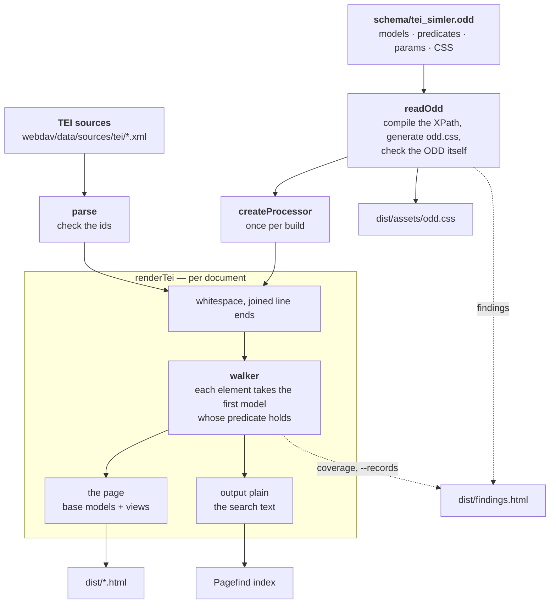

# TEI preview

Renders every TEI file in `webdav/data/sources/tei/` to a standalone HTML page.
It serves two purposes:
* editors proof the encoding before it reaches the presentation layer,
* and the rendering engine is developed here and goes back into the frontend.

## Usage

```sh
npm ci
npm run build              # whole corpus to dist/
npm run build -- A_1648    # only matching file names
npm run build -- --src ../exported --out /tmp/preview
npm run build -- --records # also: what the ODD decided, as data
npm test                   # the conformance fixtures
npm run check              # types
```

`dist/index.html` is the index. The pages open from `file://` too, but the
search and the typeface both need a server:

```sh
python -m http.server -d dist 8080     # or: npx serve dist
```

## How it works



The ODD is the only place that says how anything renders; the code reads it and
carries it out. Every element takes the first model whose predicate holds, and one
walk of the tree gives the page (the base models, with the views laid over them as
switches); a second walk gives the `plain` output, which is what the search indexes.
What the ODD itself gets wrong, and which of its models never fire, is reported on
the findings page next to what the documents get wrong.

## Layout

| Path | Contents |
| --- | --- |
| `../schema/tei_simler.odd` | The schema **and** the rendering: every element's Processing Model and all text styling |
| `lib/` | The renderer, as the package `tei-odd-interpreter`: everything below is behind `lib/index.ts` |
| `lib/odd/` | Reads the ODD: models, XPath predicates and params, the generated `odd.css` |
| `lib/tei/` | The pipeline that applies it: parsing, whitespace, hyphens, note ranges, the behaviour table, the PM walker |
| `assets/tokens.css`, `fonts.css` | Design tokens and the fallback face the ODD's CSS refers to |
| `assets/preview.css` | The preview's own chrome, as plain CSS |
| `assets/preview.js` | The switches and the two anchored panels |
| `assets/facsimile.js` | The facsimile drawer: open, close, resize; OpenSeadragon over the IIIF images |
| `assets/normalize.js` | Search normalisation — plain ESM |
| `assets/search.js` | The search page, and marking the hits in a document |
| `entities.ts` | The project's registers (persons, places, works, institutions) from `gsheet/csv`, for the entity cards |
| `page.ts` | The HTML shell: top bar, apparatus (the numbered notes, and a box per other place); index, search and findings pages |
| `build.ts` | Walks the corpus and writes `dist/` |
| `test/` | What reading the ODD must report, and one ODD with four TEI cases, one per Processing-Model feature, with what they must render |

## Using the renderer in a site (Astro, SvelteKit)

`lib/` is the package `tei-odd-interpreter`. It ships TypeScript source and needs no build
step: Vite, which Astro and SvelteKit build on, compiles it as part of the site with no
configuration (checked with `vite build --ssr`). Plain Node needs a loader
(`node --import tsx`).

```sh
npm add tei-odd-interpreter@file:../simler_data/preview/lib
```

Render at build time and on the server side only: read the ODD and create the
processor **once**, then render each document with it. The ODD's CSS reads the design
tokens (`var(--c-person)`, …), so a page needs both stylesheets.

```ts
// src/lib/edition.ts
import { readFileSync } from 'node:fs'
import { createProcessor, parse, readOdd, renderTei } from 'tei-odd-interpreter'

const read = (path: string) => readFileSync(`../simler_data/${path}`, 'utf8')
const tokens = read('preview/assets/tokens.css')
export const odd = readOdd(read('schema/tei_simler.odd'), tokens)
export const css = tokens + odd.css
const processor = createProcessor(odd)
export const render = (name: string) => renderTei(parse(read(`webdav/data/sources/tei/${name}.xml`)), processor)
```

**Astro** — `src/pages/[doc].astro`:

```astro
---
import { css, render } from '../lib/edition'
export const getStaticPaths = () => ['A_1648', 'B_1653'].map((doc) => ({ params: { doc } }))
const { html, page } = render(Astro.params.doc)
---
<Fragment set:html={`<style>${css}</style>`} />
<h1>{page.title?.[0]}</h1>
<div set:html={html} />
```

**SvelteKit** — `src/routes/[doc]/+page.server.ts` and `+page.svelte`:

```ts
import { css, render } from '$lib/edition'
export const prerender = true
export const entries = () => [{ doc: 'A_1648' }, { doc: 'B_1653' }]
export const load = ({ params }) => {
  const { html, page } = render(params.doc)
  return { html, title: page.title?.[0], css }
}
```

```svelte
<script>
  let { data } = $props()
</script>
<svelte:head>{@html `<style>${data.css}</style>`}</svelte:head>
<h1>{data.title}</h1>
<div>{@html data.html}</div>
```

What `render` returns besides `html`: `text`, the search text for any index; `notes`,
each with its `place`, its `number` and its body as HTML, for the apparatus; `page`,
the `page` model's params (`title`, `manifest`, `pages`, `entities`); and `warnings`.
The views need nothing but that CSS and an attribute: `data-normalized="on"` on an
ancestor, or a checked `#view-normalized` checkbox, switches one on — `odd.views`
names them and gives their labels. `page.ts` here is a working reference for the rest;
the note popovers, entity cards and facsimile viewer are the preview's own
`assets/*.js`, not part of the package.

## The ODD renders the text

`schema/tei_simler.odd` is the only source of truth for the rendering; the code
knows no TEI element by name. Each element takes the first `<model>` whose
`@predicate` holds, and its `@behaviour` (`block`, `inline`, `heading`, `break`,
`note`, `alternate`, …) decides the HTML. `lib/tei/behaviours.ts` gives each
behaviour the element it wraps its content in and whether that renders as a block
or inline; a behaviour that does more than wrap is written out in the walker.
A `<modelSequence>` renders each of its models whose predicate holds, one after
the other (`supplied` as its brackets and its text). A `break` with a `label` is the label, then the break (the hyphen at a
joined line end). `@rendition` styles the
element only where its model has `@useSourceRendition="true"` (or inherits it
from its `<modelGrp>`). Predicates see the text as encoded, even where the
pipeline changed what renders (the hyphen at a joined line end). Params are
XPath: the nodes they select are rendered by their own models, anything else is
text, so
`<param name="content" value="corr"/>` renders the correction. Params named
`--…` become CSS custom properties of the rendered element, `data-…` its
attributes. The element's own attributes are there too, as `data-*`
(`targetEnd` → `data-target-end`), except `@rendition`; attribute values are
read with their whitespace collapsed. `<outputRendition>` and `<tagsDecl>` compile to
`dist/assets/odd.css`; a `<modelGrp>`'s rendition styles all its models, and a
styled model among several must name its class with `@cssClass`. Whether an element counts as a
block for whitespace and line breaks follows from the model it takes where it
stands, and from its behaviour's flow. A note's `range` param names the element its commented range starts at;
the range is resolved on the rendered page, across any element boundary. Range
and marker share `data-note`: pointing at either lights up both, and clicking the
range opens the note. A `data-page` param names the facsimile image of a page
break: the drawer finds its pages by it, and clicking the break opens its page.

Models with `@output` belong to that output and take precedence over the base
models there. `plain` is rendered on its own and is what the search indexes;
what it leaves out is not searched on the page either, where a hit may span
`hi`, ranges and joined line ends. Only that rendering decides what the index
joins: a joined line end leaves neither hyphen nor word boundary behind, so the
word is one; any other line end leaves both, so it is two, exactly as the page
shows it. `normalized` (the reading text, which joins
every line but the title page's) and `entities` are the preview's switches:
views over the one page, where a model may omit the element, restyle it, or give
the same behaviour other params — an `alternate` (as for `choice`) renders every
reading once and shows each view's own default. A view's `<modelSequence>`
overlays the page's sequence model by model. **The switches are the ODD's:** every
output but `web`, `page` and `plain` becomes one, named by the first `<desc>` among
its models and explained by a second; a new view is an ODD change, and nothing here
knows their names. Each view's CSS keys on its switch as well as on the attribute
the script sets, so the views work with JavaScript off. *Anmerkungen*, *Schrift* and
*Dunkler Modus* are the preview's own controls, not renderings. The `page` model of the root element says, in its
params, what the page shows around the text: `title`, `manifest` (the IIIF
manifest), `pages` (the facsimile ids) and `entities` (the register keys).

To change how something looks or renders, edit its `elementSpec` and rebuild.
Predicates and params use an XPath subset (`lib/odd/xpath.ts`). An expression
outside it, or one that fails where it is evaluated, counts as empty — the
predicate is false and the next model decides, the param has no value — so the
corpus still renders; the build names it, `findings.html` lists it under *ODD*,
and the run ends non-zero. Reading the ODD also reports a param the behaviour does
not read, a model an earlier one makes unreachable, and a CSS custom property that
neither the design tokens nor the ODD itself defines.

Every build also reads the ODD back against the corpus: which of its models fired,
which element it has models for that the corpus never has, and which element it has
no model for. `findings.html` lists the gaps under *ODD-Abdeckung*. A model that
never fires is a finding, not an error, so it does not fail the build. With
`--records`, each document's decisions are written to `dist/records/<name>.json` —
per element the model that won, its behaviour, classes and params, and the text as
it renders. It is what another toolchain reads instead of re-implementing the
Processing Model; the pages do not need it, so it is off by default.

A source file that is not well-formed XML does not stop the others: its page says
so, with the parser's line and column, the index flags it, and `findings.html` lists
it first. It has no text, so it is missing from the search, and the run ends
non-zero, as for a flaw in the ODD.

The ODD validates against
`tei_odds.rng`: the `odd` job of the TEI Preview workflow checks it with `jing` on
every run, against a pinned TEI release.
